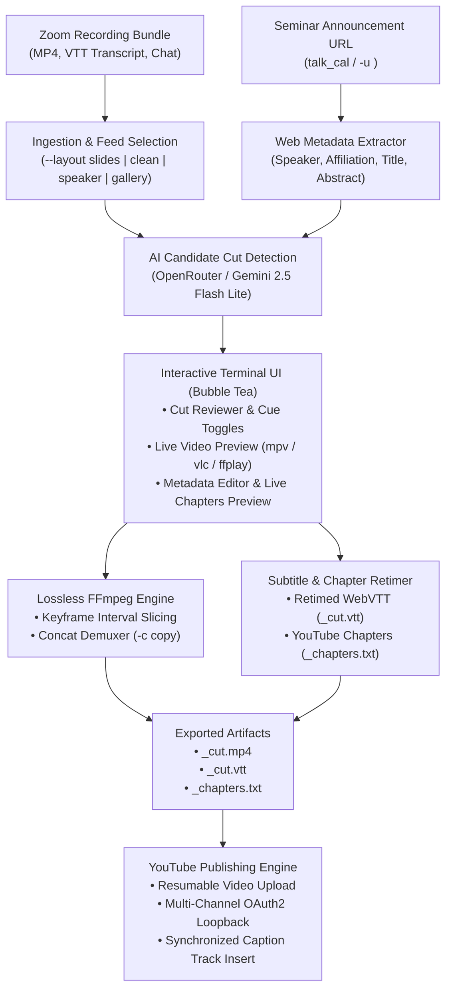

# talk_cut

[](https://golang.org)
[](https://github.com/charmbracelet/bubbletea)
[](https://ffmpeg.org)
[](https://developers.google.com/youtube/v3)
[](LICENSE)

**talk_cut** is a terminal-native, True-Color interactive CLI and [Bubble Tea](https://github.com/charmbracelet/bubbletea) application designed to edit, polish, and publish recorded academic talks, conference presentations, and seminar recordings (such as Zoom recording bundles).

It leverages an LLM (via OpenRouter, e.g. Gemini 2.5 Flash Lite) to automatically detect candidate cuts (pre-talk chatter, dead pauses, mic checks, and post-talk Q&A), provides an interactive split-pane TUI for manual review with instant external video preview, losslessly slices and splices video streams via FFmpeg (`-c copy`), recalibrates YouTube chapters to guarantee a `00:00` start, retimes WebVTT subtitles, and publishes directly to YouTube across multiple configured channels.

---

## Architecture & Workflow



---

## Core Features

- **Automated Zoom Bundle Ingestion**: Point `talk_cut` to any Zoom cloud recording folder or unpacked archive (e.g. `talk_cut recordings/2026-09-08/`). Automatically detects and correlates video streams, WebVTT subtitle transcripts, and chat logs.
- **Smart Presentation Layout Selection**: Zoom bundles often record multiple video perspectives. Choose the optimal layout using `--layout` (`slides` with speaker thumbnail, `clean` slides without thumbnail, `speaker`, or `gallery`).
- **AI Cut & Preamble Detection**: Analyzes the WebVTT transcript using token-optimized sampling with OpenRouter (Gemini 2.5 Flash Lite by default) to identify intro banter, microphone tests, slide transitions, dead pauses, and trailing audience Q&A.
- **Web Metadata Scraping & `talk_cal`**: Supply a seminar announcement web page (`-u <url>` or via the companion symlink `talk_cal <dir> <url>`) to automatically scrape the speaker's name, institutional affiliation, talk title, abstract, and tags.
- **True-Color Split-Pane Terminal Interface**:
  - **Cut Reviewer**: Scroll through timestamped transcript cues with visual status indicators (`[✔ KEEP]`, `[✂ CUT]`), speaker labels, and AI rationale badges.
  - **Live External Video Preview**: Press <kbd>p</kbd> on any subtitle cue to spawn an external player (`mpv`, `vlc`, `ffplay`, or `totem`) synchronized exactly to that moment.
  - **Full-Width Metadata & Chapter Editor**: Edit title, speaker, affiliation, announcement URL, tags, privacy (`unlisted`, `public`, `private`), and abstract. Supports clickable terminal hyperlinks via OSC 8 escape codes.
  - **Recalculated YouTube Chapters**: Real-time chapter marker recalculation that adjusts timestamps across cuts and guarantees that the first chapter starts at `00:00`.
  - **Real-Time Progress Dashboard**: Progress bar showing rendering stages (slicing, concatenation, subtitle retiming, chapter generation, and YouTube upload).
- **Lossless FFmpeg Slicing & Splicing**: Slices kept intervals and joins them using FFmpeg's `concat` demuxer with stream copying (`-c copy`). Preserves original 1080p/4K video quality with zero generational loss and completes renders in seconds.
- **Subtitle & Chapter Synchronization**: Produces retimed WebVTT (`_cut.vtt`) subtitle files and a ready-to-paste YouTube chapter file (`_chapters.txt`).
- **Multi-Channel YouTube Publishing**: Built-in OAuth2 desktop authorization loopback server supporting multiple channel profiles (e.g. `--channel seminar`, `--channel course`), resumable video uploads, and automated caption track publishing.
- **Strict Security Model**: Zero hardcoded secrets or API tokens. OpenRouter keys and OAuth tokens are stored in `~/.config/auth/` with `0600` permissions.

---

## Requirements

- **Operating System**: Linux or macOS
- **Go**: 1.22 or newer
- **FFmpeg**: `ffmpeg`, `ffprobe`, and at least one preview player (`mpv`, `vlc`, `ffplay`, or `totem`) installed in your `$PATH`
- **OpenRouter API Key** (optional, for AI cuts): Stored in `~/.config/auth/openrouter_api_key` or via `OPENROUTER_API_KEY`
- **Google Cloud OAuth Client Secrets** (optional, for YouTube upload): Downloaded from Google Cloud Console

---

## Installation

Clone the repository and build using `make`:

```bash
git clone https://github.com/sarielhp/talk_cut.git
cd talk_cut
make install
```

This validates all quality gates, builds the binary, and installs both `talk_cut` and the `talk_cal` symlink into `~/bin/`:

```bash
which talk_cut talk_cal
# ~/bin/talk_cut
# ~/bin/talk_cal
```

Ensure `~/bin` is included in your system `$PATH`.

---

## Quick Start

### 1. Dry-Run Inspection
Inspect a Zoom recording bundle, run AI cut detection, and print cut statistics without launching the terminal UI:

```bash
talk_cut --dry-run examples/26_09_08/
```

### 2. Full Interactive Editing
Launch the interactive terminal interface:

```bash
talk_cut examples/26_09_08/
```

### 3. Automatic Metadata Extraction via Web URL
Pass a seminar announcement URL to populate the speaker name, affiliation, title, and abstract automatically:

```bash
talk_cut -u "https://seminar.example.edu/talks/2026/linear-approximation" examples/26_09_08/
```

Alternatively, use the standalone `talk_cal` command to fetch and persist metadata into `talk_meta.json` without opening the editor:

```bash
talk_cal examples/26_09_08/ "https://seminar.example.edu/talks/2026/linear-approximation"
```

### 4. Direct YouTube Upload
Cut the talk and upload directly to an authorized YouTube channel upon completion:

```bash
talk_cut --upload --channel seminar examples/26_09_08/
```

---

## TUI Keyboard Shortcuts

### Cut Review Screen

| Key | Action |
|---|---|
| <kbd>j</kbd> / <kbd>k</kbd> or <kbd>↓</kbd> / <kbd>↑</kbd> | Move cursor down / up across cues |
| <kbd>PgDn</kbd> / <kbd>PgUp</kbd> | Scroll half a page down / up |
| <kbd>g</kbd> / <kbd>G</kbd> | Jump to top / bottom of transcript |
| <kbd>Space</kbd> / <kbd>x</kbd> | Toggle cue status between `[✔ KEEP]` and `[✂ CUT]` |
| <kbd>p</kbd> | Launch external video preview (`mpv`/`vlc`/`ffplay`) at current cue timestamp |
| <kbd>n</kbd> / <kbd>N</kbd> | Jump to next / previous cut region |
| <kbd>s</kbd> | Save current cut intervals to `talk_cuts.json` on disk |
| <kbd>Tab</kbd> / <kbd>Enter</kbd> | Advance to Metadata & Chapter Editor screen |
| <kbd>?</kbd> / <kbd>F1</kbd> | Toggle help modal overlay |
| <kbd>q</kbd> / <kbd>Ctrl+C</kbd> | Quit `talk_cut` |

### Metadata & Chapter Editor Screen

| Key | Action |
|---|---|
| <kbd>Tab</kbd> / <kbd>Shift+Tab</kbd> | Focus next / previous input field |
| <kbd>↓</kbd> / <kbd>↑</kbd> | Scroll down / up through the form fields and preview cards |
| <kbd>PgDn</kbd> / <kbd>PgUp</kbd> | Page scroll form viewport down / up |
| <kbd>Home</kbd> / <kbd>End</kbd> | Scroll directly to top / bottom of form |
| <kbd>Space</kbd> (on Privacy) | Cycle YouTube privacy (`unlisted` ↔ `public` ↔ `private`) |
| <kbd>Esc</kbd> | Return to Cut Review screen (automatically saves metadata) |
| <kbd>Ctrl+R</kbd> or <kbd>Enter</kbd> (on Commit) | Commit settings and begin FFmpeg slicing and rendering |

### Progress & Completion Screen

| Key | Action |
|---|---|
| <kbd>p</kbd> | Play completed cut video in external video player |
| <kbd>q</kbd> / <kbd>Esc</kbd> | Exit `talk_cut` |

---

## Multi-Channel YouTube Publishing

### 1. Obtain Google OAuth Credentials
1. Go to the [Google Cloud Console](https://console.cloud.google.com/).
2. Create a project and enable the **YouTube Data API v3**.
3. Configure an **OAuth Consent Screen** (User Type: External, Testing or Published).
4. Create an **OAuth 2.0 Client ID** with Application Type set to **Desktop app**.
5. Download the client secrets JSON file.

### 2. Authorize a YouTube Channel
Run the built-in authorization command for a given channel profile (e.g. `seminar`):

```bash
talk_cut auth --channel seminar /path/to/client_secrets.json
```

1. Starts a secure local loopback server on `127.0.0.1`.
2. Opens your default browser to authorize your YouTube account.
3. Obtains the OAuth token and stores it at `~/.config/auth/youtube_seminar.json` with `0600` permissions.
4. Registers the channel in `~/.config/talk_cut/config.json`.

You can configure multiple channels (e.g. `seminar`, `lectures`, `personal`) by repeating this step with different `--channel` names.

### 3. Publishing During Pipeline
Use the `--upload` flag:

```bash
talk_cut --upload --channel seminar recordings/2026-09-08/
```

`talk_cut` will:
1. Slice and splice the video losslessly.
2. Generate retimed `.vtt` subtitles.
3. Compute and format chapter markers.
4. Upload the video using resumable uploads with title, abstract, tags, and chapter markers.
5. Upload and synchronize the `.vtt` subtitle file as an English closed-caption track.

---

## Configuration Reference

Configuration is stored in `~/.config/talk_cut/config.json`:

```json
{
  "key_file": "~/.config/auth/openrouter_api_key",
  "model": "google/gemini-2.5-flash-lite",
  "base_url": "https://openrouter.ai/api/v1",
  "default_privacy": "unlisted",
  "preferred_layout": "slides",
  "default_channel": "seminar",
  "channels": {
    "seminar": "~/.config/auth/youtube_seminar.json",
    "personal": "~/.config/auth/youtube_personal.json"
  }
}
```

### Configuration Fields

| Setting | Type | Description |
|---|---|---|
| `key_file` | string | Path to file containing OpenRouter API key |
| `model` | string | OpenRouter model identifier (default: `google/gemini-2.5-flash-lite`) |
| `base_url` | string | Base URL for OpenRouter API |
| `default_privacy` | string | Default YouTube video privacy: `unlisted`, `public`, or `private` |
| `preferred_layout` | string | Default Zoom video layout: `slides`, `clean`, `speaker`, `gallery` |
| `default_channel` | string | Default channel profile when `--channel` is omitted |
| `channels` | map | Channel profile name to OAuth token path mappings |

### Environment Variables

| Variable | Description |
|---|---|
| `TALK_CUT_KEY_FILE` | Override OpenRouter key file path |
| `TALK_CUT_MODEL` | Override OpenRouter LLM model |
| `OPENROUTER_API_KEY` | Provide raw OpenRouter API key directly |
| `TALK_CUT_PLAYER` | Force a specific video preview player (`mpv`, `vlc`, `ffplay`) |
| `TALK_CUT_YOUTUBE_SECRETS` | Override path to Google client secrets JSON |
| `TALK_CUT_YOUTUBE_TOKEN` | Override path to OAuth token file |

---

## Output Artifacts

Running `talk_cut` generates the following files in the recording directory:

| File | Description |
|---|---|
| `<talk>_cut.mp4` | Final losslessly sliced and spliced video file |
| `<talk>_cut.vtt` | Synchronized, retimed WebVTT subtitle transcript |
| `<talk>_chapters.txt` | YouTube-formatted chapter descriptions (guaranteed `00:00` start) |
| `talk_cuts.json` | Persistent cut intervals database (auto-loaded on re-runs) |
| `talk_meta.json` | Talk metadata cache (title, speaker, abstract, tags, URL) |

---

## CLI Options Reference

```text
Usage:
  talk_cut [options] <recording-directory> [announcement-url]
  talk_cal <recording-directory> <announcement-url>
  talk_cut auth [options] [client_secrets.json]

Options:
  -o, --output <path>    Custom output destination for sliced video
  -u, --url <url>        Seminar announcement URL (extracts speaker, title, abstract)
  --meta-only            Fetch talk metadata from URL, save talk_meta.json, and exit
  --layout <type>        Preferred layout: slides (default), clean, speaker, gallery
  --no-ai                Skip AI LLM cut detection
  --re-detect            Force re-running AI cut detection even if talk_cuts.json exists
  --dry-run              Analyze and print cut plan without opening TUI
  --upload               Upload cut video to YouTube upon completion
  --channel <name>       Target YouTube channel (stores/loads ~/.config/auth/youtube_<channel>.json)
  --key-file <path>      Path to OpenRouter API key file
  --model <name>         OpenRouter model name
  -v, --version          Print version information
  -h, --help             Show help screen
```

---

## Development & Testing

All quality and verification tools adhere to Go sizing standards (nesting depth &le; 4, branches &le; 15, audited via `go-audit`):

```bash
make check        # Fast quality gate: format, go.mod, vet, staticcheck, go-audit, tests, build
make check-full   # Full gate: fast gate + deep static-analysis + live headless tmux TUI tests
make review       # Deep static review (dupl, gocritic, shadow, revive, govulncheck)
make test         # Run unit test suite
make test-tui     # Run interactive headless tmux TUI verification
make test-scroll  # Run full 540-cue scroll test
make commit       # Gated commit (verifies quality gate, stages, commits, records .verified_head)
make bump         # Increment patch version (0.1.0 -> 0.1.1) and install
make bump-minor   # Increment minor version (0.1.X -> 0.2.0) and install
```

---

## License

[MIT](LICENSE) &copy; Sariel Har-Peled
