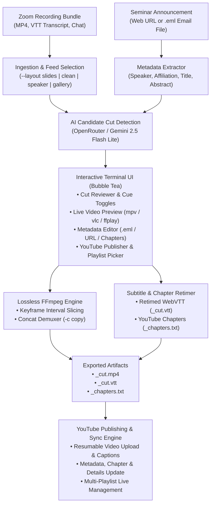

# talk_cut

[](https://golang.org)
[](https://github.com/charmbracelet/bubbletea)
[](https://ffmpeg.org)
[](https://developers.google.com/youtube/v3)
[](LICENSE)

**talk_cut** is a terminal-native, True-Color interactive CLI and [Bubble Tea](https://github.com/charmbracelet/bubbletea) application designed to edit, polish, and publish recorded academic talks, conference presentations, and seminar recordings (such as Zoom recording bundles).

It leverages an LLM (via OpenRouter, e.g. Gemini 2.5 Flash Lite) to automatically detect candidate cuts (pre-talk chatter, dead pauses, mic checks, and post-talk Q&A), provides an interactive split-pane TUI for manual review with instant external video preview, losslessly slices and splices video streams via FFmpeg (`-c copy`), recalibrates YouTube chapters to guarantee a `00:00` start, retimes WebVTT subtitles, and publishes directly to YouTube across multiple configured channels.

---

## Architecture & Workflow



---

## Core Features

- **Automated Zoom Bundle Ingestion**: Point `talk_cut` to any Zoom cloud recording folder or unpacked archive (e.g. `talk_cut recordings/2026-09-08/`). Automatically detects and correlates video streams, WebVTT subtitle transcripts, and chat logs.
- **Smart Presentation Layout Selection**: Zoom bundles often record multiple video perspectives. Choose the optimal layout using `--layout` (`slides` with speaker thumbnail, `clean` slides without thumbnail, `speaker`, or `gallery`).
- **AI Cut & Preamble Detection**: Analyzes the WebVTT transcript using token-optimized sampling with OpenRouter (Gemini 2.5 Flash Lite by default) to identify intro banter, microphone tests, slide transitions, dead pauses, and trailing audience Q&A.
- **AI Natural Chapter Detection**: Automatically detects topical chapter shifts across the talk transcript (problem statement, theorems, algorithms, evaluations, conclusions), persisting markers in `talk_meta.json` and dynamically adjusting timestamps post-cut.
- **Email Announcement (.eml) & Web Ingestion**: Automatically ingests speaker name, institutional affiliation, talk title, abstract, and tags directly from `.eml` email files placed in the talk directory, or scrapes them from a seminar announcement web URL (`-u <url>` or `--meta-only`). In the TUI, press <kbd>e</kbd> to extract from `.eml` or <kbd>u</kbd> to fetch from the URL.
- **True-Color Split-Pane Terminal Interface**:
  - **Cut Reviewer**: Scroll through timestamped transcript cues with visual status indicators (`[✔ KEEP]`, `[✂ CUT]`), speaker labels, and AI rationale badges.
  - **Live External Video Preview**: Press <kbd>p</kbd> on any subtitle cue to spawn an external player (`mpv`, `vlc`, `ffplay`, or `totem`) synchronized exactly to that moment.
  - **Full-Width Metadata & Chapter Editor**: Edit title, speaker, affiliation, announcement URL, tags, privacy (`unlisted`, `public`, `private`), and abstract. Supports clickable terminal hyperlinks via OSC 8 escape codes, and aggressively auto-saves all edits to `talk_meta.json`.
  - **Interactive YouTube Playlist Picker**: Press <kbd>p</kbd> in the YouTube tab to browse channel playlists, toggle talk membership with immediate live YouTube sync, and designate default playlists.
  - **Recalculated YouTube Chapters**: Real-time chapter marker recalculation that adjusts timestamps across cuts and guarantees that the first chapter starts at `00:00`.
  - **Real-Time Progress Dashboard**: Progress bar showing rendering stages (slicing, concatenation, subtitle retiming, chapter generation, and YouTube upload).
- **Lossless FFmpeg Slicing & Splicing**: Slices kept intervals and joins them using FFmpeg's `concat` demuxer with stream copying (`-c copy`). Preserves original 1080p/4K video quality with zero generational loss and completes renders in seconds.
- **Subtitle & Chapter Synchronization**: Produces retimed WebVTT (`_cut.vtt`) subtitle files and a ready-to-paste YouTube chapter file (`_chapters.txt`).
- **Multi-Channel YouTube Publishing**: Built-in OAuth2 desktop authorization loopback server supporting multiple channel profiles (e.g. `--channel seminar`, `--channel course`), resumable video uploads, and automated caption track publishing.
- **YouTube Details & Chapter Synchronization**: Update video title, description (with adjusted chapters and talk link), tags, privacy, and playlist assignments on YouTube for already-uploaded talks via `talk_cut youtube update` or directly from Tab 5 (<kbd>d</kbd> / <kbd>Enter</kbd>), with built-in duration validation (&plusmn;1s tolerance).
- **Multi-Playlist Management**: Organize talks across multiple YouTube playlists from the CLI (`talk_cut youtube playlist list|create|set-default|add|remove`) or interactively within the TUI.
- **Strict Security Model**: Zero hardcoded secrets or API tokens. OpenRouter keys and OAuth tokens are stored in `~/.config/auth/` with `0600` permissions.

---

## Requirements

- **Operating System**: Linux or macOS
- **Go**: 1.22 or newer
- **FFmpeg**: `ffmpeg`, `ffprobe`, and at least one preview player (`mpv`, `vlc`, `ffplay`, or `totem`) installed in your `$PATH`
- **OpenRouter API Key** (optional, for AI cuts): Stored in `~/.config/auth/openrouter_api_key` or via `OPENROUTER_API_KEY`
- **Google Cloud OAuth Client Secrets** (optional, for YouTube upload): Downloaded from Google Cloud Console

---

## Installation

Clone the repository and build using `make`:

```bash
git clone https://github.com/sarielhp/talk_cut.git
cd talk_cut
make install
```

This validates all quality gates, builds the binary, and installs `talk_cut` into `~/bin/`:

```bash
which talk_cut
# ~/bin/talk_cut
```

Ensure `~/bin` is included in your system `$PATH`.

---

## Quick Start

### 1. Dry-Run Inspection
Inspect a Zoom recording bundle, run AI cut detection, and print cut statistics without launching the terminal UI:

```bash
talk_cut --dry-run examples/26_09_08/
```

### 2. Full Interactive Editing
Launch the interactive terminal interface:

```bash
talk_cut examples/26_09_08/
```

### 3. Automatic Metadata Extraction via Web URL or .eml Email
Pass a seminar announcement URL to populate the speaker name, affiliation, title, and abstract automatically:

```bash
talk_cut -u "https://seminar.example.edu/talks/2026/linear-approximation" examples/26_09_08/
```

Or fetch and persist metadata into `talk_meta.json` without opening the editor:

```bash
talk_cut --meta-only examples/26_09_08/ "https://seminar.example.edu/talks/2026/linear-approximation"
```

If an announcement email file (`.eml`) exists in the directory, `talk_cut` extracts metadata automatically upon launch, or on demand inside the TUI by pressing <kbd>e</kbd> in Tab 2.

### 4. Direct YouTube Upload & Playlist Assignment
Cut the talk and upload directly to an authorized YouTube channel, optionally adding it to a playlist:

```bash
talk_cut --upload --channel seminar --playlist "Geometry Seminar Fall 2026" examples/26_09_08/
```

### 5. Update Details on an Already-Uploaded Talk
Update video title, description (with adjusted chapters and seminar link), tags, privacy, and playlists without re-rendering or re-uploading:

```bash
# Preview what would be updated on YouTube:
talk_cut youtube update --dry-run examples/26_09_08/

# Apply updates to YouTube (verifies talk exists and video length matches within ±1s):
talk_cut youtube update examples/26_09_08/
```

### 6. Manage YouTube Playlists via CLI
```bash
# List all playlists on the channel:
talk_cut youtube playlist list --channel seminar

# Create a new playlist and set it as default:
talk_cut youtube playlist create "Geometry Seminar Fall 2026" --default

# Add an uploaded talk to a playlist:
talk_cut youtube playlist add "Geometry Seminar Fall 2026" examples/26_09_08/
```

---

---

## TUI Keyboard Shortcuts

### Global Navigation (All Screens)

| Key | Action |
|---|---|
| <kbd>←</kbd> / <kbd>→</kbd> | Switch between tabs (`[1] Cut Review` ↔ `[2] Metadata` ↔ `[3] Chapters` ↔ `[4] Render` ↔ `[5] YouTube`) |
| <kbd>1</kbd> .. <kbd>5</kbd> | Jump directly to tab 1, 2, 3, 4, or 5 |
| <kbd>q</kbd> / <kbd>Ctrl+C</kbd> | Quit `talk_cut` |

---

### [1] Cut Review Screen

| Key | Action |
|---|---|
| <kbd>j</kbd> / <kbd>k</kbd> or <kbd>↓</kbd> / <kbd>↑</kbd> | Move cursor down / up across cues |
| <kbd>PgDn</kbd> / <kbd>PgUp</kbd> | Scroll half a page down / up |
| <kbd>g</kbd> / <kbd>G</kbd> | Jump to top / bottom of transcript |
| <kbd>Space</kbd> / <kbd>x</kbd> | Toggle cue status between `[✔ KEEP]` and `[✂ CUT]` |
| <kbd>p</kbd> | Launch external video preview (`mpv`/`vlc`/`ffplay`) at current cue timestamp |
| <kbd>n</kbd> / <kbd>N</kbd> | Jump to next / previous cut region |
| <kbd>[</kbd> / <kbd>]</kbd> | Jump to previous / next chapter marker in transcript |
| <kbd>m</kbd> | Add or remove chapter marker bookmark (`🔖`) at focused cue |
| <kbd>s</kbd> | Save current cut intervals to `talk_cuts.json` on disk |
| <kbd>r</kbd> / <kbd>Ctrl+A</kbd> | Regenerate natural chapters with AI (analyzes kept speech) |
| <kbd>c</kbd> / <kbd>Ctrl+R</kbd> | Advance to Export & Render tab to execute video cutting |
| <kbd>Tab</kbd> | Advance to Metadata screen |
| <kbd>?</kbd> / <kbd>F1</kbd> | Toggle floating help dialog overlay |

---

### [2] Metadata Screen

| Key | Action |
|---|---|
| <kbd>↓</kbd> / <kbd>↑</kbd> (or <kbd>j</kbd>/<kbd>k</kbd>) | Navigate between form fields and sections |
| <kbd>Enter</kbd> | Enter edit mode for focused field (or commit on button) |
| <kbd>Esc</kbd> / <kbd>Enter</kbd> | Exit edit mode (returns to global tab navigation) |
| <kbd>Tab</kbd> / <kbd>Shift+Tab</kbd> | Cycle focus to next / previous input field |
| <kbd>e</kbd> | Extract & fill metadata from `.eml` email announcement in directory |
| <kbd>u</kbd> | Fetch & fill metadata from Announcement URL |
| <kbd>Space</kbd> (on Privacy) | Cycle YouTube privacy (`unlisted` ↔ `public` ↔ `private`) |
| <kbd>Ctrl+A</kbd> / <kbd>r</kbd> | Regenerate natural chapters with AI (analyzes kept speech) |
| <kbd>PgDn</kbd> / <kbd>PgUp</kbd> | Page scroll form viewport down / up |
| <kbd>Home</kbd> / <kbd>End</kbd> | Scroll directly to top / bottom of form |
| <kbd>Esc</kbd> (when not editing) | Return to Cut Review screen (all edits are auto-saved to `talk_meta.json`) |
| <kbd>Ctrl+R</kbd> / <kbd>c</kbd> | Advance to Export & Render tab |

---

### [3] YouTube Chapters Manager

| Key | Action |
|---|---|
| <kbd>↓</kbd> / <kbd>↑</kbd> (or <kbd>j</kbd>/<kbd>k</kbd>) | Select chapter marker in outline |
| <kbd>Enter</kbd> / <kbd>e</kbd> | Edit chapter title in-place |
| <kbd>d</kbd> / <kbd>x</kbd> | Delete currently selected chapter marker |
| <kbd>a</kbd> | Add new chapter marker |
| <kbd>p</kbd> | Preview video playback at chapter start timestamp |
| <kbd>r</kbd> / <kbd>Ctrl+A</kbd> | Auto-detect chapters with AI from kept speech |
| <kbd>Esc</kbd> | Return to Cut Review screen |

---

### [4] Export & Render Screen

| Key | Action |
|---|---|
| <kbd>c</kbd> / <kbd>Enter</kbd> | Start FFmpeg lossless slice & concat pipeline |
| <kbd>u</kbd> (when complete) | Switch directly to `[5] YouTube` upload screen |
| <kbd>p</kbd> (when complete) | Play cut video in external video player (`ffplay`) |
| <kbd>Esc</kbd> (before render) | Return to Cut Review screen |
| <kbd>q</kbd> | Exit `talk_cut` |

---

### [5] YouTube Publish & Verification Screen

#### Standard View

| Key | Action |
|---|---|
| <kbd>u</kbd> / <kbd>Enter</kbd> (before upload) | Start resumable video upload, captions sync, and playlist sync |
| <kbd>d</kbd> / <kbd>Enter</kbd> (when uploaded) | Update details on YouTube (title, description, chapters, tags, privacy, playlists) |
| <kbd>p</kbd> | Open Interactive Playlist Picker overlay |
| <kbd>c</kbd> (before upload) | Cycle through configured YouTube channels (`default`, `seminar`, etc.) |
| <kbd>o</kbd> (when published) | Open verified short URL (`https://youtu.be/<id>`) in default web browser |
| <kbd>c</kbd> / <kbd>y</kbd> (when published) | Copy verified short URL to system clipboard (`wl-copy` / `xclip`) |
| <kbd>u</kbd> (when published) | Force re-upload video |
| <kbd>p</kbd> (before upload) | Preview local cut video in `ffplay` |
| <kbd>r</kbd> | Retry upload or jump to render screen if video is not rendered |
| <kbd>Esc</kbd> | Return to Cut Review screen |
| <kbd>q</kbd> | Exit `talk_cut` |

#### Playlist Picker Overlay (<kbd>p</kbd>)

| Key | Action |
|---|---|
| <kbd>↓</kbd> / <kbd>↑</kbd> (or <kbd>j</kbd>/<kbd>k</kbd>) | Navigate channel playlists |
| <kbd>Space</kbd> / <kbd>Enter</kbd> / <kbd>x</kbd> | Toggle talk playlist membership (immediately calls YouTube API if uploaded) |
| <kbd>d</kbd> | Designate selected playlist as channel default in `~/.config/talk_cut/config.json` |
| <kbd>Esc</kbd> / <kbd>p</kbd> | Close playlist picker overlay |

---

## Multi-Channel YouTube Publishing

### 1. Guided Setup & Detailed Guide
`talk_cut` includes an interactive setup wizard and comprehensive built-in documentation:

```bash
# Print full, detailed step-by-step setup guide (GCP console, consent screen, quotas, etc.):
talk_cut youtube setup -H

# Run interactive terminal setup wizard:
talk_cut youtube setup

# Inspect configured channels and token validity:
talk_cut youtube status
```

### 2. Direct Channel Authorization
To authorize or re-authorize a channel directly:

```bash
talk_cut youtube auth --channel seminar
# or (backward compatible):
talk_cut auth --channel seminar /path/to/client_secrets.json
```

1. Starts a secure local loopback server on `127.0.0.1`.
2. Opens your default browser to authorize your YouTube account.
3. Obtains the OAuth token and stores it at `~/.config/auth/youtube_seminar.json` with `0600` permissions.
4. Registers the channel in `~/.config/talk_cut/config.json`.

You can configure multiple channels (e.g. `seminar`, `lectures`, `personal`) by repeating this step with different `--channel` names.

### 3. Publishing During Pipeline
Use the `--upload` flag:

```bash
talk_cut --upload --channel seminar recordings/2026-09-08/
```

`talk_cut` will:
1. Slice and splice the video losslessly.
2. Generate retimed `.vtt` subtitles.
3. Compute and format chapter markers.
4. Upload the video using resumable uploads with title, abstract, tags, and chapter markers.
5. Upload and synchronize the `.vtt` subtitle file as an English closed-caption track.
6. Synchronize playlist memberships (including default channel playlist).

### 4. Updating Details on Already-Uploaded Talks
If you have already uploaded a talk to YouTube and need to update its title, description (with adjusted chapters and seminar URL), tags, privacy, or playlist assignments, run:

```bash
# Preview changes and verify durations:
talk_cut youtube update --dry-run recordings/2026-09-08/

# Synchronize updates to YouTube:
talk_cut youtube update --channel seminar recordings/2026-09-08/
```

**Safety Protection**: `talk_cut youtube update` automatically queries YouTube's `videos.list` endpoint to verify that the video ID exists, retrieves its duration, and compares it against the local cut video (`_cut.mp4`). If the durations differ by more than &plusmn;1 second, the command aborts to prevent updating the wrong video.

### 5. Managing YouTube Playlists
Manage playlists from the CLI or within the TUI:

```bash
# List all playlists owned by the authenticated channel:
talk_cut youtube playlist list --channel seminar

# Create a new playlist and optionally set it as default:
talk_cut youtube playlist create "Algorithms Seminar 2026" --description "Fall 2026 talks" --default

# Designate a default playlist for future uploads:
talk_cut youtube playlist set-default "Algorithms Seminar 2026"

# Add an uploaded talk (by folder or video ID) to a playlist:
talk_cut youtube playlist add "Algorithms Seminar 2026" recordings/2026-09-08/
talk_cut youtube playlist add "Algorithms Seminar 2026" dQw4w9WgXcQ

# Remove a talk from a playlist:
talk_cut youtube playlist remove "Algorithms Seminar 2026" recordings/2026-09-08/
```

**Multi-Playlist Support**: A talk can belong to multiple playlists. All assigned playlists are tracked in `talk_meta.json` under `"playlists": [{"id": "...", "title": "..."}]` and synchronized during upload, update, or when toggled in the TUI (<kbd>p</kbd>).

---

## Configuration Reference

Configuration is stored in `~/.config/talk_cut/config.json`:

```json
{
  "key_file": "~/.config/auth/openrouter_api_key",
  "model": "google/gemini-2.5-flash-lite",
  "base_url": "https://openrouter.ai/api/v1",
  "default_privacy": "public",
  "preferred_layout": "slides",
  "default_channel": "seminar",
  "default_playlist": "PLeTNkk9BjmVQxxxxxxx",
  "channels": {
    "seminar": "~/.config/auth/youtube_seminar.json",
    "personal": "~/.config/auth/youtube_personal.json"
  }
}
```

### Configuration Fields

| Setting | Type | Description |
|---|---|---|
| `key_file` | string | Path to file containing OpenRouter API key |
| `model` | string | OpenRouter model identifier (default: `google/gemini-2.5-flash-lite`) |
| `base_url` | string | Base URL for OpenRouter API |
| `default_privacy` | string | Default YouTube video privacy: `unlisted`, `public`, or `private` |
| `preferred_layout` | string | Default Zoom video layout: `slides`, `clean`, `speaker`, `gallery` |
| `default_channel` | string | Default channel profile when `--channel` is omitted |
| `default_playlist` | string | Default YouTube playlist ID assigned to new talks |
| `channels` | map | Channel profile name to OAuth token path mappings |

### Environment Variables

| Variable | Description |
|---|---|
| `TALK_CUT_KEY_FILE` | Override OpenRouter key file path |
| `TALK_CUT_MODEL` | Override OpenRouter LLM model |
| `OPENROUTER_API_KEY` | Provide raw OpenRouter API key directly |
| `TALK_CUT_PLAYER` | Force a specific video preview player (`mpv`, `vlc`, `ffplay`) |
| `TALK_CUT_YOUTUBE_SECRETS` | Override path to Google client secrets JSON |
| `TALK_CUT_YOUTUBE_TOKEN` | Override path to OAuth token file |
| `TALK_CUT_DEFAULT_PLAYLIST` | Override default YouTube playlist ID |

---

## Output Artifacts

Running `talk_cut` generates the following files in the recording directory:

| File | Description |
|---|---|
| `<talk>_cut.mp4` | Final losslessly sliced and spliced video file |
| `<talk>_cut.vtt` | Synchronized, retimed WebVTT subtitle transcript |
| `<talk>_chapters.txt` | YouTube-formatted chapter descriptions (guaranteed `00:00` start) |
| `talk_cuts.json` | Persistent cut intervals database (auto-loaded on re-runs) |
| `talk_meta.json` | Talk metadata cache (title, speaker, abstract, tags, URL, YouTube ID, short URL, playlists) |

---

## CLI Options Reference

```text
Usage:
  talk_cut [options] <recording-directory> [announcement-url]
  talk_cut youtube update [options] <recording-directory>
  talk_cut youtube playlist <list|create|set-default|add|remove> [options]
  talk_cut youtube setup [-H]            Interactive guided setup (-H for detailed guide)
  talk_cut youtube status                Inspect configured YouTube channels and tokens
  talk_cut auth [options] [secrets.json] Direct OAuth browser authorization

Options:
  -o, --output <path>    Custom output destination for sliced video
  -u, --url <url>        Seminar announcement URL (extracts speaker, title, abstract)
  --meta-only            Fetch talk metadata from URL, save talk_meta.json, and exit
  --update-youtube       Update talk details on YouTube for an already uploaded talk
  --playlist <name|id>   Add video to specified YouTube playlist
  --layout <type>        Preferred layout: slides (default), clean, speaker, gallery
  --no-ai                Skip AI LLM cut detection
  --re-detect            Force re-running AI cut detection even if talk_cuts.json exists
  --dry-run              Analyze and print cut plan without opening TUI or modifying YouTube
  --upload               Upload cut video to YouTube upon completion
  --channel <name>       Target YouTube channel (stores/loads ~/.config/auth/youtube_<channel>.json)
  --key-file <path>      Path to OpenRouter API key file
  --model <name>         OpenRouter model name
  -v, --version          Print version information
  -h, --help             Show help screen
```

---

## Development & Testing

All quality and verification tools adhere to Go sizing standards (nesting depth &le; 4, branches &le; 15, audited via `go-audit`):

```bash
make check        # Fast quality gate: format, go.mod, vet, staticcheck, go-audit, tests, build
make check-full   # Full gate: fast gate + deep static-analysis + live headless tmux TUI tests
make review       # Deep static review (dupl, gocritic, shadow, revive, govulncheck)
make test         # Run unit test suite
make test-tui     # Run interactive headless tmux TUI verification
make test-scroll  # Run full 540-cue scroll test
make commit       # Gated commit (verifies quality gate, stages, commits, records .verified_head)
make bump         # Increment patch version (0.1.0 -> 0.1.1) and install
make bump-minor   # Increment minor version (0.1.X -> 0.2.0) and install
```

---

## License

[MIT](LICENSE) &copy; Sariel Har-Peled
